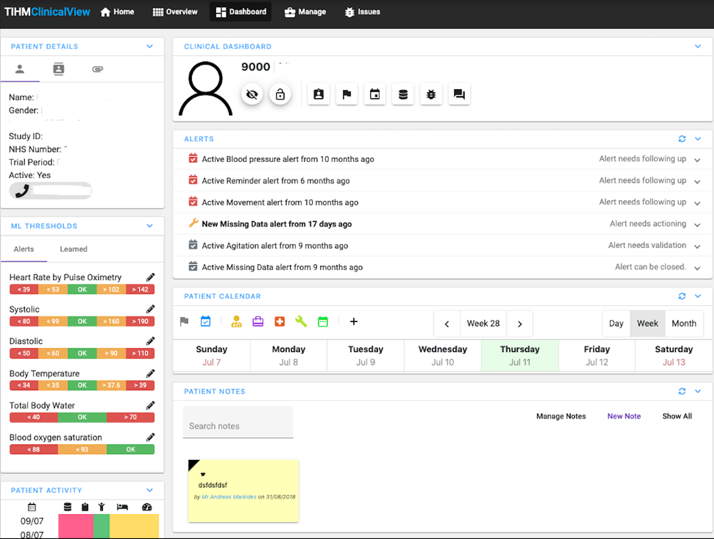
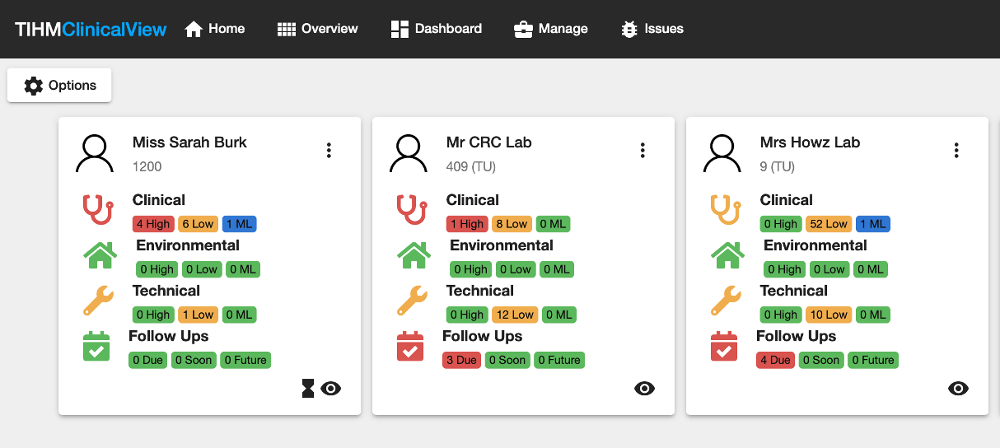
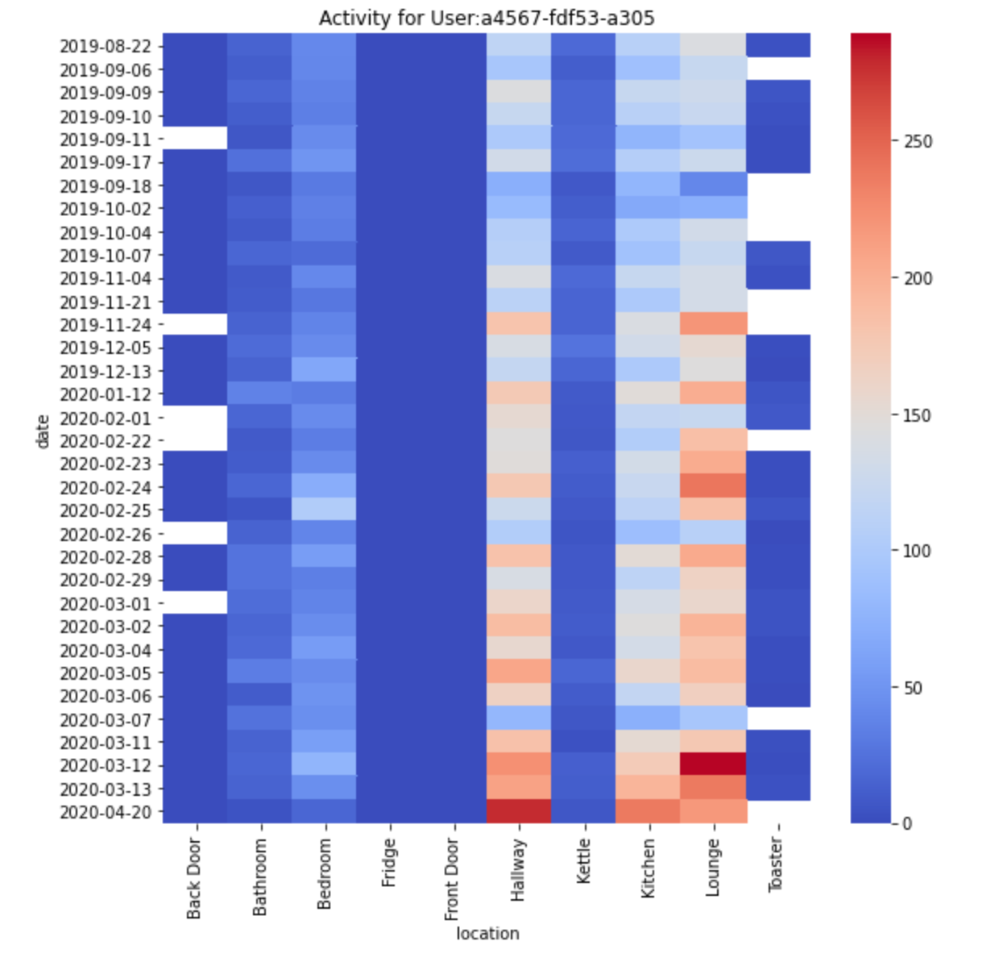
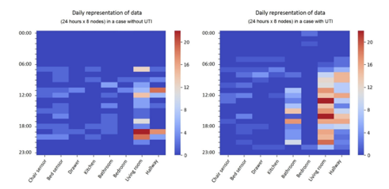
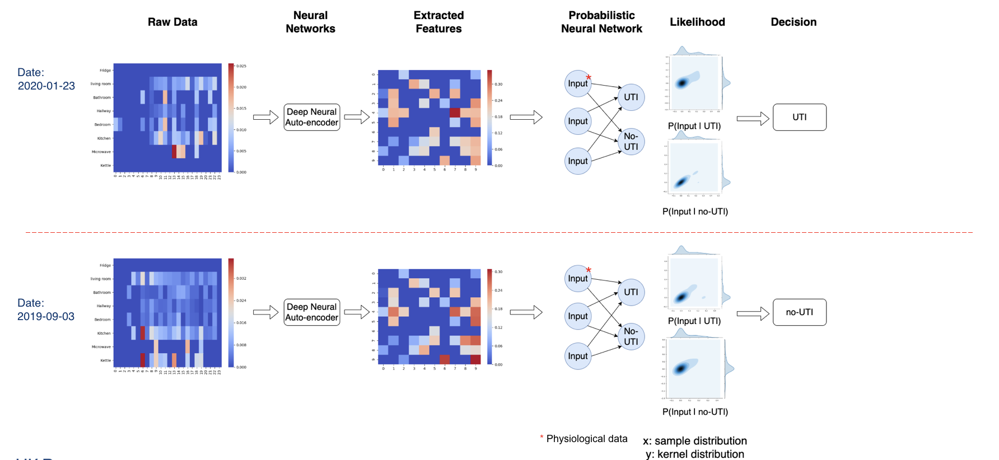

# A Semi-supervised Model to Analyse Partially Labelled and Imbalanced Healthcare Data

Accessing sufficient training samples and labelling the data in remote healthcare monitoring applications is a time-consuming and resource-intensive task. The lack of training samples hinder the generalisability of the learning algorithms and can introduce unwanted bias to the trained model. We demonstrate a semi-supervised model to process partially labelled and imbalanced data in a remote healthcare monitoring application to support people affected by dementia. The model is designed to analyse the risk of Urinary Tract Infections (UTIs). UTIs are one of the top reasons for unplanned hospital admissions in people with dementia, and if detected early, they can be treated and avoid unplanned hospital admissions. The model is trained on a large dataset collected from over 150 homes and is integrated into a digital platform that we have designed for dementia care. Here we briefly introduce our digital healthcare platform and machine learning model. An online demo is available [here](https://tihm-iot-dev.ee.surrey.ac.uk).

This is the user interface, which can largely help the clinical team to check the data collected from users if abnormal cases detected.

In this project, a model is designed to analyse the risk of Urinary Tract Infections (UTIs). UTIs are one of the top reasons for unplanned hospital admissions in people with dementia, and if detected early, they can be treated and avoid unplanned hospital admissions. 

To provide ealier detection of UTI symptoms, we deploy several sensors to collect the daily activaties patterns. 

We have collected the physiological data

also the environmental data are collected 

To detect the symptoms of UTI, we care more about the environmental data. We have deployed eight environmental sensors in the patients' home to collected thoses data. 
Here is how the data looks like:

To help our model to learn the data patterns more efficiently, we aggregate the values of each sensor within one hour. Here is the heat maps of a UTI and a no-UTI cases after aggregating.

The collected data will be analysed by our machine learning models and report to the clinical team if an abnormal case is detected. However, this could be really a challenging task. 
Verifying the cases are positive or not are time-consuming and a majority of our samples are unlabelled. Actually, only around 1.5\% of the data is labelled.

To deal with this issue, we leverage the semi-supervised learning techniques to train the models. Different from the conventional semi-supervised learning models, we leverage the probabilistic neural networks to estimate the density distribution of the data. We leverage the concept of self-training to train the auto-encoder and increase the margin between the positive and negative samples. Please check our paper for the further details.

The model is deployed in an instance of the platform used in a clinical study to detect the risk of UTIs.

